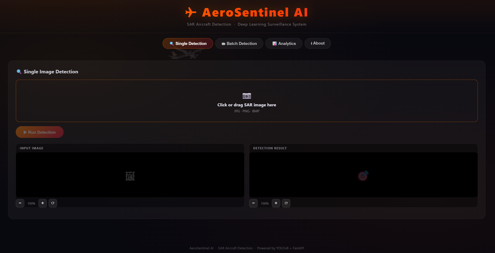

# AeroSentinel AI

AeroSentinel AI is a web-based application for detecting aircraft in Synthetic Aperture Radar (SAR) images using a trained Ultralytics YOLO model.

The application allows users to upload SAR images, detect aircraft, compare predictions with ground-truth annotations, and view evaluation metrics through an easy-to-use web interface.

## Home Page


---

## Features

- Aircraft detection from SAR images
- Single image detection
- Batch image detection
- Automatic ground-truth comparison
- Bounding box visualization
- Live Precision, Recall, Accuracy, and mAP evaluation
- Confusion Matrix generation
- FastAPI backend with a simple web interface

---

## Tech Stack

- Python
- FastAPI
- Ultralytics YOLO
- OpenCV
- HTML
- CSS
- JavaScript

---

## Project Structure

```
AeroSentinel-AI
│
├── backend
│   ├── main.py
│   ├── best.pt
│   └── requirements.txt
│
├── frontend
│   └── index.html
│
├── .gitignore
└── README.md
```

---

## Installation

Clone the repository:

```bash
git clone https://github.com/pravalikaranka/AeroSentinel-AI.git
```

Install the required packages:

```bash
pip install -r backend/requirements.txt
```

Start the backend:

```bash
cd backend
python -m uvicorn main:app --reload --port 8000
```

Open `frontend/index.html` in your browser or run it using the VS Code Live Server extension.

---

## API Endpoints

| Endpoint | Method | Description |
|----------|--------|-------------|
| `/detect` | POST | Detect aircraft in a single image |
| `/detect-batch` | POST | Detect aircraft in multiple images |
| `/metrics` | GET | View evaluation metrics |
| `/clear-session` | POST | Clear current session data |

---

## Applications

- Aircraft surveillance
- Remote sensing
- Defense applications
- SAR image analysis
- Deep learning research

---

## Author

**Pravalika Ranka**

M.Tech, Electronics and Communication Engineering
